<p align="center">
  
</p>

<h1 align="center">Tanmay Savaj</h1>

<p align="center">
  <strong>Software Engineer | Backend | Cloud | AI</strong>
</p>

<p align="center">
  Toronto, Canada | Computer Programming @ Seneca Polytechnic | Enterprise Web Developer, Ontario Public Service
</p>

<p align="center">
  
</p>

<p align="center">
  <a href="https://github.com/Tanmaysavaj">
    
  </a>
</p>

---

## About

I build practical software systems across backend engineering, cloud platforms, automation, and AI-enabled products. My work is shaped by clean interfaces, reliable delivery, and the kind of engineering discipline that keeps projects maintainable after the first version ships.

Current areas of interest:

- Backend Engineering
- Cloud Computing
- AI
- DevOps
- Distributed Systems
- System Design

---

## Current Focus

```text
role        Enterprise Web Developer, Ontario Public Service
education   Computer Programming, Seneca Polytechnic
location    Toronto, Canada
focus       Backend systems, cloud delivery, automation, AI products
learning    Go, Kubernetes, Azure, Terraform, distributed systems
```

---

## Tech Stack

<p align="center">
  
</p>

<p align="center">
  <sub>Also working with Bitbucket Pipelines and modern backend API workflows.</sub>
</p>

---

## Featured Projects

| Project | Focus | Stack |
| --- | --- | --- |
| **IntelliApply** | AI-powered career automation platform for streamlining job applications. | Python, Docker, AWS, AI APIs |
| **Slack x Plane Integration** | Slack workflow integration for creating and managing Plane tickets. | Python, Flask, Slack API |
| **Preventive Health Risk Behavior System** | Full-stack platform for preventive health risk behavior tracking. | Vue, Go, PostgreSQL, Docker |
| **Portfolio Website** | Personal portfolio for projects, writing, experience, and updates. | Next.js, TypeScript, Tailwind CSS |

---

## Developer Dashboard

```text
status       building production-minded software
mode         backend-first, cloud-aware, automation-friendly
principles   clear APIs, observable systems, simple deployments
editor       terminal when possible, GUI when useful
runtime      coffee, docs, focused commits
```

---

## GitHub Analytics

<p align="center">
  
  
</p>

<p align="center">
  
</p>

<p align="center">
  
</p>

<p align="center">
  
</p>

<p align="center">
  
</p>

<p align="center">
  
</p>

---

## Currently Learning

- Go for backend services and tools
- Kubernetes for operating containerized systems
- Azure DevOps for enterprise delivery
- Terraform for infrastructure as code
- Distributed systems and system design fundamentals

---

## 2026 Goals

- [x] Start Enterprise Web Developer role
- [ ] Build production-grade services in Go
- [ ] Deploy and operate Kubernetes workloads
- [ ] Complete an Azure certification
- [ ] Use Terraform in a real infrastructure project
- [ ] Launch a focused SaaS product
- [ ] Reach 1,000 GitHub contributions
- [ ] Grow into a full-time Software Engineer role

---

## Connect

<p align="center">
  <span>Portfolio</span>
  |
  <span>LinkedIn</span>
  |
  <span>Email</span>
  |
  <a href="https://github.com/Tanmaysavaj">GitHub</a>
  |
  <span>Resume</span>
</p>

<p align="center">
  <strong>Build. Break. Learn. Repeat.</strong>
</p>
