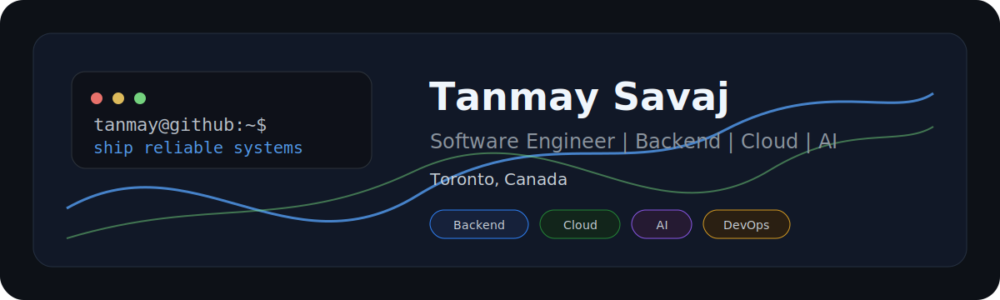

# Hey, I'm Tanmay Savaj


<p align="center">
  I build practical software systems, automate workflows, and turn ideas into reliable products.
</p>


<p align="center">



</p>


</p>


---

## About Me

I'm a software developer based in Toronto, Canada, focused on backend engineering,
cloud-native applications, DevOps, and AI-powered products.

- Computer Programming student at Seneca Polytechnic
- Incoming Enterprise Web Developer at Ontario Public Service
- Interested in backend systems, cloud platforms, automation, and applied AI
- Currently learning Go, Kubernetes, Azure, Terraform, and system design
- Always building side projects that solve real problems

---

## Tech Stack

### Languages


### Backend


### Frontend


### Cloud, DevOps & Databases


---

## Featured Projects

| Project | What it does | Tech |
| --- | --- | --- |
| **IntelliApply** | AI-powered career automation platform that helps job seekers streamline applications. | Python, Docker, AWS, AI APIs |
| **Slack x Plane Integration** | Slack bot for creating and managing Plane.so tickets directly from Slack workflows. | Python, Flask, Slack API |
| **Preventive Health Risk Behavior System** | Full-stack health tracking platform for monitoring preventive health risk behavior. | Vue, Go, PostgreSQL, Docker |
| **Portfolio** | Personal portfolio for projects, blogs, experience, and professional updates. | Next.js, TypeScript, Tailwind CSS |

---

## GitHub Analytics

<p align="center">
  
</p>

<p align="center">
  
</p>

---

## Currently Learning

- Go for backend services and tooling
- Kubernetes for orchestration and deployment workflows
- Azure DevOps for enterprise cloud delivery
- Terraform for infrastructure as code
- System design and distributed systems fundamentals

---

## 2026 Goals

- [x] Start Enterprise Web Developer internship
- [ ] Build production-grade services in Go
- [ ] Get comfortable deploying and operating Kubernetes workloads
- [ ] Complete an Azure certification
- [ ] Use Terraform in a real infrastructure project
- [ ] Launch a SaaS product
- [ ] Reach 1,000 GitHub contributions
- [ ] Grow into a full-time Software Engineer role

---

## Developer Notes

```text
terminal > gui
docker fixed it
works on my machine
coffee > sleep
currently overengineering side projects
building cool things
```

---

## Let's Connect

<p align="center">
  <a href="https://www.linkedin.com/in/tanmaysavaj">
    
  </a>
  <a href="https://github.com/Tanmaysavaj">
    
  </a>
  <a href="tanmaysavaj@gmail.com">
    
    </a>
  <a href="https://tanmaysavaj.vercel.app/">
    
    </a>
</p>

---

<p align="center">
  <strong>Build. Break. Learn. Repeat.</strong>
</p>
